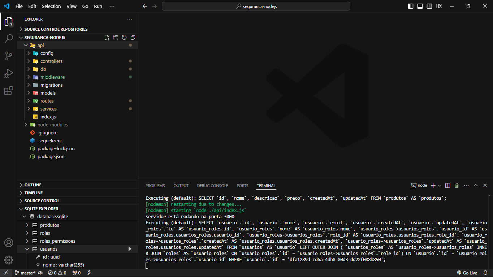

# supermercado

> Esse projeto foi fundamentado em um supermercado fictício, onde pude aprimorar minhas habilidades em autenticação, operações CRUD, relacionamentos entre tabelas e desenvolvimento de middlewares de segurança, para validar perfis e permissões dos usuários.

## 💻 Pré-requisitos

Antes de começar, verifique se você atendeu aos seguintes requisitos:

- node: 18.15.0
- nodemon
- bcryptjs
- express
- sequelize
- sequelize-cli
- sqlite3

## 🚀 Instalando Supermercado

Para instalar o Supermercado, siga estas etapas:

## comando_de_instalação e rodar o projeto
- git cloner 
- npm install
- npm run start 

## 📝 Licença

Esse projeto está sob licença. Veja o arquivo [LICENÇA](LICENSE.md) para mais detalhes.
